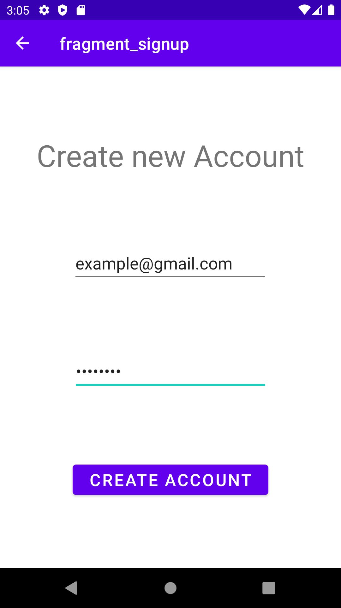

# Login and Signup Application
this is a simple Login and Signup application 

## App Archticture
the application contains **only one Main Activity and multiple Fragments**, 
which uses Navigation Components and Navigation Graph

for a Clear understanding the application life 

## Application Walkthrough

### 1. Login
1. open the application and see login screen 
   
2. fill the data *email and password* and click Login button 
   
3. you can see the email and password in the home screen 
> **Note** to login successfully use email: 'some@gmail.com' and password: '1234'

### 2. Signup
1. open the application and click Signup Link 
   
2. you will see signup screen 
   
3. fill the data *email and password* and click Create Account button

4. you will see email confirmation screen 
5. fill the confirmation code **000** then click confirm 
6. finally you have reached the home screen with new user data you typed before 
